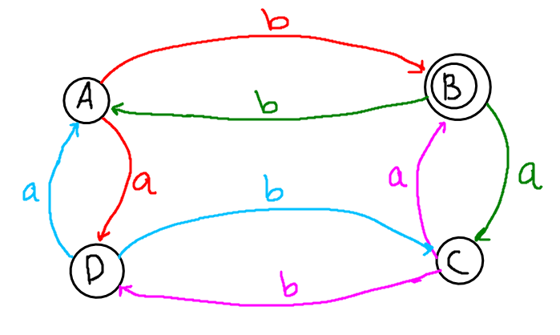

# DFA Example of Impelementation in python

I have coded a DFA (Deterministic Finite Accepter) Example that it takes a string made with just character that are in alphabet and then using delta function, I loop over string and at the end user get a boolean result that shows string is accepted or not by the machine.

## DFA Schema:



### DFA Solution:

In the end, this DFA and example only accept strings with **even count of "a"** and **odd count of "b"**.

### Tests:

There is also a test file in **Tests/** that can be run to check the correction of module and add your tests also!

```python
python -m unittest -v test_solution.py
```